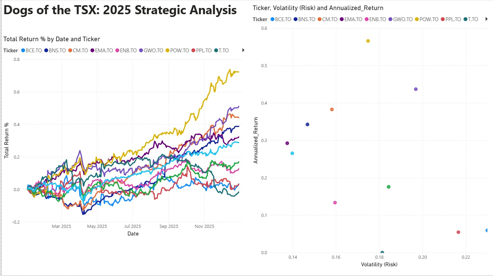

# Dogs of the TSX: 2025 Strategic Analysis

### Objective
To quantitatively backtest the performance and risk-adjusted returns of the "Dogs of the TSX" (High Dividend Yield) strategy against the TSX 60 Benchmark for the 2025 volatility cycle.

### Dashboard Preview

*(Note: Download the .pbix file above to interact with the full dashboard)*

### Methodology
* **Universe:** TSX 60 Index constituents.
* **Selection Rule:** Top 10 stocks by Dividend Yield at Jan 1, 2025.
* **Rebalancing:** Annual.
* **Metrics Calculated:** Total Return (Price + Reinvested Dividends), Annualized Volatility, Sharpe Ratio.

### Technical Stack
* **Data Extraction:** Python (`yfinance` API) for programmatic ETL.
* **Data Modeling:** Power BI (Star Schema) with DAX measures for time-intelligence.
* **Visualization:** Efficient Frontier (Scatter Plot) and Normalized Equity Curves.

### Key Findings
1.  **Alpha Generation:** The strategy significantly outperformed the benchmark, driven largely by the Financials and Insurance sectors (specifically **Power Corp**).
2.  **Risk efficiency:** Higher yield did not correlate with higher volatility. The portfolio achieved a superior Sharpe Ratio compared to the broad index.
